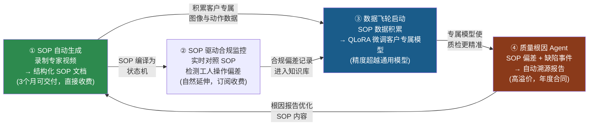
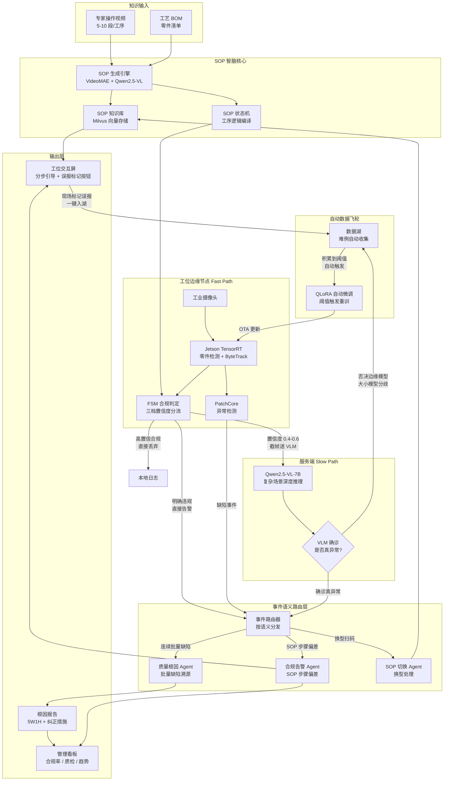
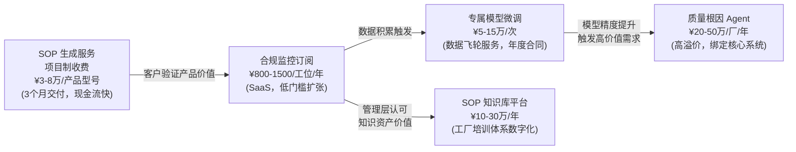

---

name: SOP智脑
overview: 放弃宽平台，聚焦蓝海：以"SOP 智能化平台"为核心产品，垂直切入动力电池装配场景，用 VLM + 动作识别将专家操作经验自动转化为结构化 SOP，并以此为飞轮驱动合规监控、专属模型微调、质量根因溯源，形成竞争对手难以复制的数据护城河。
todos:

- id: p1-sop-gen
content: 核心能力：SOP 自动生成 Pipeline——录制专家操作视频 → VideoMAE 分段提取原子动作 → Qwen2.5-VL-7B 理解语义 → 输出结构化 SOP 文档（步骤 + 关键帧截图 + 注意事项），可直接交付客户。
status: completed
- id: p1-sop-fsm
content: 构建 SOP 状态机：将生成的 SOP 原子动作序列编译为 FSM，用于实时对照工人操作，检测步骤缺失、顺序颠倒、超时。
status: completed
- id: p1-compliance
content: 实时合规监控（三档置信度级联）：边缘节点 FSM 判定分三档——高置信合规直接丢弃、不确定区间（0.4-0.6）截帧送 VLM 深度推理、明确违规直接触发告警。大小模型判断分歧时自动将该帧写入数据湖（难例自动收集，无需人工整理训练集）。
status: pending
- id: p1-workstation-ui
content: 工位交互屏：分步 SOP 视频引导 + 实时合规状态高亮，当动作犹豫 > 3 秒或检测到操作偏差时主动推送提示；增加"标记为误报"一键按钮，现场人员确认误报后自动写入数据湖，触发定期自动重训，形成人工闭环反馈。
status: completed
- id: p2-finetune
content: 自动化数据飞轮：数据湖持续收集两类难例——① VLM 否决边缘模型的分歧帧（自动入湖）；② 现场人工标记的误报帧（一键入湖）。达到阈值后自动触发 QLoRA 微调 Pipeline（RTX 消费级 GPU），生成客户专属模型，OTA 部署到 Jetson，无需人工干预整理训练集。
status: pending
- id: p2-anomaly
content: 装配质检增强：在微调检测模型基础上叠加 PatchCore 无监督异常检测（仅需良品图像），实现换型时零标注成本的缺陷识别。
status: pending
- id: p2-event-router
content: 事件语义路由层：在合规事件进入 Agent 之前增加事件路由器，按语义将事件分类——SOP 步骤偏差 → 合规告警 Agent、连续缺陷 → 质量根因 Agent、换型扫码 → SOP 切换 Agent，每个 Agent 只处理自己语义范围内的事件，避免上下文混用。
status: pending
- id: p2-root-cause
content: 质量根因 Agent（LangGraph）：由事件路由器分发"批量缺陷"类事件触发，自动关联 SOP 偏差记录、操作员班次、时序参数，输出根因报告（5W1H）+ 纠正措施，将质量工程师数天调查缩短至分钟级。Human-in-Loop：报告经质量工程师确认后触发 MES 工单。
status: pending
- id: p3-knowledge-base
content: SOP 知识库产品化：多产品 SOP 版本管理、跨工位知识共享、新员工入职培训系统，独立定价为 SaaS 订阅。
status: pending
- id: p3-saas
content: SaaS 化与规模扩展：多租户隔离、边缘节点 OTA 热更新管理、用量计费，从单工厂复制到 CATL/BYD 供应链工厂群。
status: pending

---

# SOP 智脑 — 动力电池装配 SOP 智能化平台

> **战略定位**：不做宽平台，做垂直纵深。以"自动生成 SOP → 驱动合规监控 → 沉淀专属数据 → 微调专有模型 → 质量根因溯源"的飞轮为核心，切入动力电池装配场景，构建竞争对手难以复制的数据护城河。

---

## 一、为什么是动力电池装配？


| 选择依据    | 动力电池 | 说明                                              |
| ------- | ---- | ----------------------------------------------- |
| SOP 复杂度 | 极高   | 电芯装配 → 极片卷绕 → 模组组装 → PACK，每道工序 100+ 步骤          |
| 知识传承危机  | 严重   | 宝马沈阳 300 名工人需 150 门课 + 3-6 个月虚拟产线培训，才能上岗第六代电池量产 |
| 缺陷代价    | 极高   | 电池缺陷 = 安全召回，单次事故损失数亿，质量溯源是刚需                    |
| 行业增速    | 全球最快 | CATL、BYD 全球建厂，每个新厂都面临"经验复制"问题                   |
| 竞争空白    | 确认存在 | 海康威视做视频安防，Cognex 做通用缺陷检测，无人专注于 **SOP 知识化**      |


---

## 二、核心飞轮模型




**飞轮的护城河本质**：每个客户的数据只为自己的模型服务，越用越准。竞争对手即使拿到同样的技术栈，也没有这份数据——这是无法购买的壁垒。

---

## 三、明确不做的事（战略边界）


| 放弃项            | 放弃原因                                |
| -------------- | ----------------------------------- |
| 通用 PPE / 安全帽检测 | 海康威视出厂摄像头已内置，3000 元/路，无法竞争          |
| 危险区域入侵检测       | 商汤、旷视已大规模部署，完全商品化                   |
| 生产排程优化 Agent   | 深度依赖 MES/ERP 历史数据，集成周期 2-3 年，不适合切入期 |
| 能耗优化 Agent     | 需要全厂设备数据，且与我们的 SOP 核心能力无关           |
| 供应链协同 Agent    | 不在我们的视觉数据生成范围内                      |
| 多行业铺开          | 资源分散致死，动力电池足够大                      |


---

## 四、产品功能架构

### 4.1 系统全景




### 4.2 三大核心能力详解

**① SOP 自动生成引擎（产品入口，Phase 1 主交付物）**

- 录制 5-10 段专家操作视频（每段 2-10 分钟）
- VideoMAE 对视频进行时序动作分段，识别原子动作边界
- Qwen2.5-VL-7B 理解每个片段的语义：操作对象、动作类型、注意事项
- 输出结构化 SOP 文档：步骤编号 + 关键帧截图 + 文字描述 + 视频时间戳索引
- 支持版本管理（产品换型时仅需录制差异片段，增量更新）
- **交付形式**：可导出 PDF / HTML / 工位屏交互格式，直接替代人工编写的纸质 SOP

**② 实时合规监控（三档置信度级联 + 自动数据飞轮）**

边缘 FSM 按置信度将每帧判定结果分三档处理，最大化推理效率：


| 档位    | 条件                    | 处理方式            | 成本       |
| ----- | --------------------- | --------------- | -------- |
| 高置信合规 | FSM 置信度 > 0.7         | 本地日志，不上传        | 零 VLM 费用 |
| 不确定区间 | 置信度 0.4-0.6           | 截帧送服务端 VLM 深度推理 | 按需消耗     |
| 明确违规  | FSM 置信度 < 0.4 或触发关键规则 | 直接路由告警，不等 VLM   | 零延迟      |


**大小模型分歧自动入湖**：当 VLM 判断结果与边缘模型相反时，该帧自动标注后写入数据湖——这些分歧帧天然是边缘模型的盲区样本，是最有价值的微调数据，无需人工整理。

**误报一键入湖**：工位屏和管理看板均提供"标记为误报"按钮，现场人员确认误报后一键写入数据湖，与自动收集的分歧帧共同触发定期 QLoRA 重训 → OTA 部署，形成完整的自运行飞轮。

**③ 事件语义路由层（Phase 2）**

合规事件、质检缺陷事件、换型事件在进入 Agent 之前先经过路由层按语义分类：

- `SOP 步骤偏差` → 合规告警 Agent（推送工位屏提示）
- `连续批量缺陷` → 质量根因 Agent（触发溯源分析）
- `换型扫码识别` → SOP 切换 Agent（从知识库加载新产品 SOP）

每个 Agent 只处理自己语义范围内的事件，避免单一 Agent 上下文过载导致推理质量下降。

**④ 质量根因 Agent（高价值输出，Phase 2）**

- 触发条件：路由层分发的"批量缺陷"类事件（连续 N 个缺陷或严重等级超阈值）
- LangGraph Agent 自动执行：
  1. 查询 TimescaleDB：该时间段的 SOP 合规率趋势
  2. 关联：操作员 ID、班次、SOP 步骤偏差记录
  3. 关联：Jetson 记录的零件批次扫码信息
  4. 生成根因报告（5W1H 格式）+ 纠正措施建议
- 将数天的质量工程师调查压缩至分钟级
- Human-in-Loop：输出报告需质量工程师确认后才触发 MES 工单

---

## 五、各模块技术规格

> 按目录模块组织，每个模块标注对应 Todo、引入阶段及完整技术决策。开发者执行某个 Todo 时，直接查阅对应模块规格，无需翻查其他章节。

---

### `sop_engine/` — SOP 生成核心

**对应 Todo**：`p1-sop-gen`　**引入阶段**：Phase 1


| 子模块                | 技术选型                                      | 关键参数                                                     |
| ------------------ | ----------------------------------------- | -------------------------------------------------------- |
| `video_parser/`    | VideoMAE-Base（fine-tune）                  | 输入：16 帧片段，输出：动作类别 + 置信度；滑动窗口步长 8 帧                       |
| `vlm_annotator/`   | Qwen2.5-VL-7B via vLLM                    | 输入：关键帧图像 + 动作类别；输出：JSON（步骤描述、操作对象、注意事项）                  |
| `sop_compiler/`    | Python（Pydantic 数据模型）                     | SOP 文档格式：JSON Schema v1；FSM 编译为 Python `transitions` 状态机 |
| `version_manager/` | PostgreSQL（sop_versions 表）+ MinIO（视频文件存储） | 每个 SOP 版本保留完整快照；换型时增量 diff 记录                            |


---

### `edge_node/` — 工位边缘节点

**对应 Todo**：`p1-sop-fsm`、`p1-compliance`、`p2-anomaly`　**引入阶段**：Phase 1（FSM + 检测）；Phase 2（PatchCore）


| 子模块            | 技术选型                                            | 关键参数                                                                             |
| -------------- | ----------------------------------------------- | -------------------------------------------------------------------------------- |
| `pipeline/`    | GStreamer 1.x + OpenCV 4.x CUDA                 | RTSP 接入，零拷贝内存映射；最大支持 4 路 1080p@30fps                                             |
| `inference/`   | TensorRT 10，YOLOv10-S（客户专属 INT8 微调版）+ ByteTrack | 目标检测延迟 < 20ms；ByteTrack 维持跨帧工人/零件身份 ID                                           |
| `fsm_runtime/` | Python `transitions` 库，运行于独立线程                  | FSM 判定延迟 < 5ms；三档输出：`COMPLIANT`（> 0.7）/ `UNCERTAIN`（0.4-0.6）/ `VIOLATION`（< 0.4） |
| `anomaly/`     | PatchCore（torchvision ResNet-50 特征提取）           | 仅需良品图像建立特征库；Phase 2 引入，与检测模型并行运行                                                 |
| **帧上传协议**      | gRPC（`frame_upload.proto`，二进制流）                 | 仅 `UNCERTAIN` 档触发上传；最大帧大小 500KB（JPEG 压缩）；超时 2s                                   |


**硬件**：NVIDIA Jetson Orin NX 16GB（单工位标准配置）；TensorRT 量化模型通过 OTA 热更新加载

---

### `services/compliance_service/` — 合规事件服务

**对应 Todo**：`p1-compliance`　**引入阶段**：Phase 1


| 组件       | 技术选型                                | 说明                                                                                   |
| -------- | ----------------------------------- | ------------------------------------------------------------------------------------ |
| gRPC 接收端 | Python gRPC server                  | 接收边缘节点上传的 `UNCERTAIN` 帧，转发给 VLM                                                      |
| VLM 调用   | HTTP → vLLM OpenAI 兼容接口             | Prompt 模板：当前 SOP 步骤上下文 + 帧图像；输出：`{is_anomaly: bool, reason: str, confidence: float}` |
| 分歧检测     | Python 比对逻辑                         | VLM 结论与边缘模型结论不一致时，触发写入数据湖                                                            |
| 事件写入     | Kafka topic: `compliance.events`    | 消息格式：`{timestamp, workstation_id, event_type, sop_step, frame_path, confidence}`     |
| 时序存储     | TimescaleDB（`compliance_events` 超表） | 保留 90 天；用于合规率趋势查询                                                                    |


---

### `services/event_router/` — 事件语义路由层

**对应 Todo**：`p2-event-router`　**引入阶段**：Phase 2


| 组件   | 技术选型                                             | 路由规则                                                                                                                              |
| ---- | ------------------------------------------------ | --------------------------------------------------------------------------------------------------------------------------------- |
| 消费端  | Python Kafka Consumer（`compliance.events` topic） | 按 `event_type` 字段路由                                                                                                               |
| 路由逻辑 | Python 规则引擎（简单 if/else，不引入额外框架）                  | `SOP_VIOLATION` → `comply_alert` Agent；`BATCH_DEFECT`（连续 3 次）→ `quality_root_cause` Agent；`MODEL_CHANGEOVER` → `sop_switch` Agent |
| 路由输出 | 各 Agent 的 FastAPI 内部 HTTP 接口                     | 异步 POST，不等待 Agent 返回结果                                                                                                            |


---

### `services/agents/` — Agent 层

**对应 Todo**：`p2-root-cause`　**引入阶段**：Phase 2


| Agent                 | 技术选型                                    | 工具列表                                                            |
| --------------------- | --------------------------------------- | --------------------------------------------------------------- |
| `comply_alert/`       | LangGraph（单节点，无需复杂状态机）                  | 企业微信/钉钉 Webhook；工位屏 WebSocket 推送                                |
| `quality_root_cause/` | LangGraph（多节点：查询→关联→生成报告→Human-in-Loop） | TimescaleDB 查询工具；MES REST API；PostgreSQL 零件批次表；报告写入 `reports` 表 |
| `sop_switch/`         | LangGraph（单节点）                          | Milvus 查询（按产品型号召回 SOP）；工位屏 WebSocket 推送新 SOP                    |
| **LLM 后端**            | DeepSeek-V3 API（专网）或 Qwen3-32B 本地部署     | Agent 推理用；与 VLM（Qwen2.5-VL）分开部署，避免资源争抢                          |


**Human-in-Loop 实现**：`quality_root_cause` Agent 生成报告后挂起，向管理看板推送审批请求；质量工程师点击"确认"后 Agent 恢复，触发 MES 工单创建。

---

### `data_lake/` — 自动数据飞轮

**对应 Todo**：`p2-finetune`（收集侧）；`p1-compliance`、`p1-workstation-ui`（写入侧）　**引入阶段**：Phase 1（收集器）；Phase 2（自动重训触发）


| 子模块          | 技术选型                         | 关键设计                                                                                                         |
| ------------ | ---------------------------- | ------------------------------------------------------------------------------------------------------------ |
| `collector/` | Python 写入 MinIO（S3 兼容，自托管）   | 两类入口：① compliance_service 写入分歧帧（自动）；② 工位屏 API `POST /feedback/false-positive`（人工）；统一存入 `bucket: hard-cases/` |
| `labeler/`   | Python 脚本，读取分歧帧的 VLM 结论作为伪标签 | 分歧帧：VLM 结论为标签；误报帧：标签强制为 `COMPLIANT`                                                                          |
| `trigger/`   | Celery + Redis（定时任务）         | 每日凌晨检查：当 `hard-cases/` 新增样本 ≥ 200 张时，自动提交 QLoRA 微调任务                                                         |


**数据格式**：每条样本 = `{frame_path(MinIO), label, sop_step, workstation_id, source: auto|manual, timestamp}`，存 PostgreSQL `data_lake_samples` 表作元数据索引。

---

### `model_pipeline/` — 模型微调流水线

**对应 Todo**：`p2-finetune`　**引入阶段**：Phase 2


| 子模块             | 技术选型                                              | 关键参数                                                        |
| --------------- | ------------------------------------------------- | ----------------------------------------------------------- |
| `qlora_tuning/` | unsloth + QLoRA（4-bit）；基础模型 YOLOv10-S             | 硬件：RTX 4090 / 5090；训练数据：从 MinIO 拉取，按客户 ID 隔离；每次微调约 30-60 分钟 |
| `quantization/` | TensorRT `trtexec`，INT8 校准集来自良品帧                  | 导出 `.engine` 文件；目标推理延迟 < 20ms on Jetson Orin NX             |
| `local_dev/`    | RTX 4090 本地 + Ollama（Qwen2.5-VL-7B GGUF 量化版）      | 仅用于开发阶段本地验证 Prompt 逻辑和 VLM 推理结果，不参与生产部署；无需启动完整 vLLM 服务      |
| OTA 部署          | 边缘节点开机检查 MinIO `bucket: models/` 版本号；有更新则下载替换并热重载 | 重载期间旧模型继续推理，切换无停机                                           |


---

### `frontend/` — 前端

**对应 Todo**：`p1-workstation-ui`、`p3-knowledge-base`　**引入阶段**：Phase 1


| 子模块            | 技术选型                                     | 关键交互                                                                                           |
| -------------- | ---------------------------------------- | ---------------------------------------------------------------------------------------------- |
| `workstation/` | React 18 + shadcn/ui + WebSocket（实时推送）   | 分步 SOP 视频播放（HLS）；当前步骤高亮；偏差告警弹窗；"标记为误报"按钮（调用 `POST /feedback/false-positive`，返回 200 后按钮变灰防重复提交） |
| `dashboard/`   | React 18 + Grafana（iframe 嵌入）+ shadcn/ui | 合规率趋势（TimescaleDB → Grafana）；质检热力图；根因报告列表（含审批按钮）；数据湖样本量与重训状态                                   |


---

### `deployment/` — 部署配置

**对应 Todo**：`p3-saas`　**引入阶段**：Phase 1（单厂 Docker Compose）；Phase 3（多租户 K8s）


| 场景       | 技术选型                           | 说明                                                                      |
| -------- | ------------------------------ | ----------------------------------------------------------------------- |
| 单工厂 PoC  | Docker Compose                 | 一键启动全部服务（vLLM、FastAPI、PostgreSQL、TimescaleDB、Milvus、MinIO、Redis、Celery） |
| 多工厂 SaaS | Kubernetes + Helm Charts       | 每个客户独立 namespace；数据库按 schema 隔离；模型文件按 MinIO bucket 隔离                   |
| 边缘 OTA   | 边缘节点 Python 守护进程，轮询 MinIO 版本接口 | 无需 K8s，Jetson 侧轻量实现；更新包含：TensorRT `.engine` + FSM 状态机定义文件               |


---

## 六、项目目录结构（AI 原生 + 效能工程标准）

> **升级说明**：在原有业务模块基础上，按六项 AI 原生工程标准重组。原 `services/`、`sop_engine/`、`data_lake/` 等业务模块迁移至 `src/` 分层体系；`edge_node/`、`model_pipeline/`、`frontend/` 因独立部署保持顶层位置不变。

```
sop-intelligence-platform/
│
├── AGENTS.md                        # ① 全局 AI 宪法：编码规范、分层约束、提交规则
├── SPEC.md                          # ① 任务追踪器：当前 Sprint 目标、进行中 Todo、已完成里程碑
├── README.md
│
├── docs/                            # ② 唯一事实来源 (SSOT) —— AI 修改代码前必读
│   ├── architecture/
│   │   ├── overview.md              # 系统全景架构图（对应 Plan 第四章）
│   │   ├── data-flow.md             # Fast Path / Slow Path / 飞轮数据流
│   │   ├── layering.md              # 分层依赖规则：Types→Config→Services→Adapters→API
│   │   └── adr/                     # 架构决策记录（ADR）
│   │       ├── ADR-001-vlm-qwen.md  # 为何选 Qwen2.5-VL 而非 GPT-4V
│   │       ├── ADR-002-grpc.md      # 边缘传帧用 gRPC 而非 HTTP 的理由
│   │       └── ADR-003-minio.md     # 数据湖用 MinIO 而非云 S3 的理由
│   ├── domain-logic.md              # 领域规则：SOP FSM 状态定义、置信度阈值（0.4/0.6/0.7）
│   ├── eval-standards.md            # 各模块 Harness 质量基准（Recall>0.95、AUROC>0.90 等）
│   └── module-specs/                # 各模块技术规格（对应 Plan Section 5）
│       ├── sop-engine.md
│       ├── edge-node.md
│       ├── compliance-service.md
│       ├── event-router.md
│       ├── agents.md
│       ├── data-lake.md
│       └── model-pipeline.md
│
├── .ai/                             # ④ Agent 技能空间
│   ├── SKILL.md                     # 本项目特殊操作总索引
│   ├── skills/
│   │   ├── tensorrt-int8.md         # TensorRT INT8 量化专项指令（校准集准备→trtexec→验证）
│   │   ├── qlora-tuning.md          # QLoRA 微调标准流程（数据格式→训练→导出）
│   │   ├── grpc-proto-update.md     # 更新 frame_upload.proto 的完整步骤
│   │   └── patchcore-setup.md       # PatchCore 特征库重建流程（换型时使用）
│   └── prompts/
│       ├── sop-generation.txt       # SOP 生成 VLM Prompt 模板（含 few-shot 示例）
│       ├── vlm-anomaly-check.txt    # 异常判定 VLM Prompt 模板（含 SOP 步骤上下文注入）
│       └── root-cause-analysis.txt  # 质量根因 Agent System Prompt 模板
│
├── .idx/                            # ⑤ 沙盒化可重现开发环境
│   └── dev.nix                      # Nix 环境定义：CUDA 12.x、GStreamer、Python 3.11、
│                                    #   TensorRT、vLLM、Kafka 客户端、MinIO 客户端一键就绪
│
├── src/                             # ③ 业务源码（严格单向依赖分层，禁止跨层反向引用）
│   │
│   ├── types/                       # Layer 1：类型定义（零外部依赖）
│   │   ├── sop.py                   # SOPDocument、SOPStep、FSMState（Pydantic）
│   │   ├── events.py                # ComplianceEvent、AnomalyEvent、RouteEvent
│   │   ├── frames.py                # VideoFrame、AnnotatedFrame、DataLakeSample
│   │   └── models.py                # ModelVersion、EvalMetrics、InferenceResult
│   │
│   ├── config/                      # Layer 2：配置（仅依赖 types）
│   │   ├── edge.py                  # Jetson 硬件参数、GStreamer pipeline 字符串
│   │   ├── vlm.py                   # vLLM URL、置信度阈值常量（CONF_LOW=0.4、CONF_HIGH=0.7）
│   │   ├── kafka.py                 # Topic 名称、消费者组 ID
│   │   ├── storage.py               # MinIO bucket 名、PostgreSQL DSN、Milvus collection
│   │   └── agents.py                # LangGraph 超时、Human-in-Loop 等待时长
│   │
│   ├── services/                    # Layer 3：核心业务逻辑（依赖 types + config）
│   │   ├── sop_engine/
│   │   │   ├── AGENTS.md            # ① sop_engine 专属规则：VLM Prompt 修改须同步 .ai/prompts/
│   │   │   ├── video_parser.py      # VideoMAE 动作分段
│   │   │   ├── vlm_annotator.py     # Qwen2.5-VL 语义理解
│   │   │   ├── sop_compiler.py      # 输出 SOPDocument + 编译 FSM
│   │   │   └── version_manager.py   # SOP 版本 diff 与快照
│   │   ├── compliance/
│   │   │   ├── AGENTS.md            # ① compliance 专属规则：阈值修改须同步 docs/domain-logic.md
│   │   │   ├── fsm_runtime.py       # SOP 状态机运行（服务端版，与边缘共享 types）
│   │   │   ├── confidence_classifier.py  # 三档置信度分类逻辑
│   │   │   └── divergence_detector.py    # 大小模型分歧检测 → 触发数据湖写入
│   │   ├── agents/
│   │   │   ├── AGENTS.md            # ① agents 专属规则：所有 Agent 须含 Human-in-Loop 节点
│   │   │   ├── comply_alert.py      # 合规告警 Agent（LangGraph）
│   │   │   ├── quality_root_cause.py # 质量根因 Agent（LangGraph 多节点）
│   │   │   └── sop_switch.py        # SOP 切换 Agent（LangGraph）
│   │   ├── event_router/
│   │   │   └── router.py            # Kafka 消费 → 语义分类 → 路由到对应 Agent
│   │   └── data_lake/
│   │       ├── collector.py         # 分歧帧 + 误报帧写入 MinIO
│   │       ├── labeler.py           # VLM 结论作为伪标签自动打标
│   │       └── trigger.py           # Celery 任务：样本 ≥ 200 时触发 QLoRA
│   │
│   ├── adapters/                    # Layer 4：外部系统适配器（依赖 types + config，禁止含业务逻辑）
│   │   ├── edge/
│   │   │   ├── grpc_server.py       # 接收边缘 UNCERTAIN 帧（frame_upload.proto）
│   │   │   └── ota_client.py        # 向 Jetson 推送 TensorRT 模型更新
│   │   ├── storage/
│   │   │   ├── minio_client.py      # MinIO 读写封装
│   │   │   ├── postgres_client.py   # PostgreSQL 读写封装（含 TimescaleDB 超表）
│   │   │   └── milvus_client.py     # Milvus 向量读写封装
│   │   ├── messaging/
│   │   │   ├── kafka_producer.py    # 合规事件发布
│   │   │   └── kafka_consumer.py    # 事件路由消费
│   │   └── external/
│   │       ├── mes_client.py        # MES REST API（根因报告 → MES 工单）
│   │       └── webhook_client.py    # 企业微信 / 钉钉 Webhook
│   │
│   └── api/                         # Layer 5：API 入口（可依赖所有层，禁止含业务逻辑）
│       ├── routes/
│       │   ├── sop.py               # SOP 生成与版本管理接口
│       │   ├── compliance.py        # 合规查询接口
│       │   ├── feedback.py          # POST /feedback/false-positive（误报标记）
│       │   └── reports.py           # 根因报告列表与审批接口
│       └── websocket/
│           └── workstation.py       # 工位屏实时推送（FSM 状态 + 告警）
│
├── edge_node/                       # 边缘节点（独立部署于 Jetson，不在 src/ 分层内）
│   ├── AGENTS.md                    # ① edge 专属规则：实时性约束、禁止网络 I/O 阻塞主线程
│   ├── pipeline/                    # GStreamer + OpenCV CUDA 零拷贝流水线
│   ├── inference/                   # TensorRT 推理封装（加载 .engine 文件）
│   ├── tracking/                    # ByteTrack 实例追踪
│   ├── fsm_runtime/                 # 边缘 FSM（轻量版，共享 src/types/sop.py）
│   └── anomaly/                     # PatchCore 特征库匹配
│
├── model_pipeline/                  # 模型训练流水线（独立，非生产服务）
│   ├── qlora_tuning/                # QLoRA 微调脚本（unsloth，RTX 4090/5090）
│   ├── quantization/                # TensorRT INT8 量化导出（trtexec）
│   └── local_dev/                   # 本地快速验证（RTX 4090 + Ollama）
│
├── frontend/                        # 前端（独立构建部署）
│   ├── workstation/                 # 工位交互屏（React + shadcn/ui + WebSocket）
│   └── dashboard/                   # 管理看板（React + Grafana iframe）
│
├── tests/                           # ⑥ TDD 2.0 验证层（"无测试，不提交"由 AGENTS.md 强制）
│   ├── harness/                     # Eval Harness：AI 输出质量评估（区别于普通单元测试）
│   │   ├── sop_gen_eval/
│   │   │   ├── eval_dataset/        # 标注视频片段（人工标注 Ground Truth SOP）
│   │   │   ├── metrics.py           # 步骤完整性、关键帧准确率
│   │   │   └── run_eval.py          # 驱动评估，输出达标/不达标报告
│   │   ├── compliance_eval/
│   │   │   ├── eval_dataset/        # 合规/违规/模糊视频片段各 50 段
│   │   │   ├── metrics.py           # Recall > 0.95、FPR < 5%、UNCERTAIN 比例 < 15%
│   │   │   └── run_eval.py
│   │   ├── anomaly_eval/
│   │   │   ├── eval_dataset/        # 良品 / 缺陷图像集
│   │   │   ├── metrics.py           # AUROC > 0.90
│   │   │   └── run_eval.py
│   │   └── root_cause_eval/
│   │       ├── eval_dataset/        # 历史缺陷案例（含真实根因标注）
│   │       ├── metrics.py           # 根因命中率 > 0.80
│   │       └── run_eval.py
│   ├── unit/                        # 单元测试（pytest，纯逻辑，无 I/O）
│   │   ├── test_sop_compiler.py
│   │   ├── test_fsm_runtime.py
│   │   ├── test_confidence_classifier.py
│   │   └── test_event_router.py
│   ├── integration/                 # 集成测试（Docker Compose 环境，含真实 Kafka/MinIO）
│   │   ├── test_compliance_pipeline.py   # 边缘帧 → gRPC → VLM → Kafka 全链路
│   │   └── test_data_lake_trigger.py     # 样本积累 → Celery 触发 → QLoRA 启动
│   └── performance/                 # 性能 Harness（基准回归，每次变更必跑）
│       ├── bench_edge_inference.py  # Jetson Orin NX：YOLOv10 延迟 < 20ms
│       └── bench_grpc_upload.py     # gRPC 帧上传吞吐 > 30fps
│
├── data/
│   ├── sop_templates/               # SOP 文档模板
│   └── migrations/                  # 数据库迁移（Alembic）
│
└── deployment/
    ├── docker-compose/              # 单工厂 PoC 一键启动
    ├── helm-charts/                 # 多租户 SaaS K8s 部署
    └── ota/                         # Jetson 边缘节点热更新脚本
```

### 六项升级改动说明


| #   | 新增内容                                                                           | 改动目的                                                                                                                                          |
| --- | ------------------------------------------------------------------------------ | --------------------------------------------------------------------------------------------------------------------------------------------- |
| ①   | `AGENTS.md`（根 + 5 处嵌套）+ `SPEC.md`                                              | **机器说明书**：AI Agent 每次开始工作前读 `SPEC.md` 确认当前任务，读 `AGENTS.md` 知道规则边界；嵌套版本覆盖全局规则，让 sop_engine 和 edge_node 有各自的局部约束                                |
| ②   | `docs/` 升级为 SSOT，含 ADR + domain-logic + eval-standards + module-specs          | **防止 AI 幻觉腐化架构**：所有置信度阈值、FSM 状态定义、Harness 质量指标只在 `docs/` 里有一份，AI 修改代码前必须检索此处，确保逻辑不偏离                                                          |
| ③   | `src/` 按 Types→Config→Services→Adapters→API 严格分层                               | **防止 AI Slop 腐化依赖**：低层不得 import 高层（types 不得 import services），CI 通过 `import-linter` 强制检查；原 `services/`、`data_lake/` 等平铺模块迁入此分层体系               |
| ④   | `.ai/skills/` + `.ai/prompts/`                                                 | **Agent 技能注入**：TensorRT 量化、QLoRA 微调这类专项操作有专属指令文件，避免 AI 每次重新"发明"流程；Prompt 模板版本化管理，与代码一起 review                                                 |
| ⑤   | `.idx/dev.nix`                                                                 | **沙盒化环境**：任何人（包括 AI Agent）`nix develop` 即可获得完全一致的 CUDA + GStreamer + Python 环境，消除"在我机器上能跑"问题；AI 可自主运行集成测试而无需人工配环境                             |
| ⑥   | `tests/harness/` + `tests/unit/` + `tests/integration/` + `tests/performance/` | **TDD 2.0**：`harness/` 是 AI 质量 Eval（先于实现存在）；`unit/` 是函数正确性；`integration/` 验证跨模块链路；`performance/` 是延迟基准回归；`AGENTS.md` 全局规定"无 Harness 达标，不合并代码" |


---

### 如何用这套结构指挥 AI Agent 开发

**每次开始新任务，给 AI 的标准指令模板：**

```
1. 读 SPEC.md，确认当前任务是 [todo-id]
2. 读 AGENTS.md（根）+ [对应子目录]/AGENTS.md，了解约束
3. 读 docs/module-specs/[模块名].md，了解技术规格
4. 读 docs/domain-logic.md，确认业务规则（置信度阈值等）
5. 如涉及 AI 组件，先在 tests/harness/[模块]_eval/ 准备 eval_dataset 和 metrics.py
6. 实现代码，确保 src/ 分层依赖不违反 docs/architecture/layering.md
7. 运行 tests/harness/run_eval.py 直到指标达标
8. 运行 tests/performance/ 基准回归
9. 更新 SPEC.md，标记任务完成
```

**层级的使用场景：**

- **只改 `src/types/`**：影响全部层，须同步更新 `docs/domain-logic.md` 并全跑测试
- **只改 `src/adapters/`**：仅影响外部系统接口，不触碰业务逻辑
- **改 AI Prompt**：必须同步更新 `.ai/prompts/` 和 `docs/module-specs/`，重跑对应 `harness/run_eval.py`
- **边缘节点变更**：仅在 `edge_node/` 内操作，遵循其 `AGENTS.md` 实时性约束

---

## 七、商业变现路径（飞轮对应定价）




- **获客策略**：以 SOP 生成服务作为低门槛切入，3 个月交付可见成果，现金流正向，不依赖长期融资
- **防守策略**：客户数据和专属模型无法迁移，形成高转换成本（竞争对手无法复制这份数据）
- **扩张策略**：一个大厂客户（如 CATL 供应商）的多个工厂 → 标准化复制，边际成本趋近于零

---

## 八、分阶段实施路线

```mermaid
gantt
    title SOP 智脑 实施路线图
    dateFormat MM
    axisFormat 第%m月

    section Phase 1 建立核心产品
    SOP生成 Pipeline 开发       :p1a, 01, 6w
    工位合规监控 MVP            :p1b, after p1a, 6w
    第一个真实客户 PoC          :p1c, after p1b, 4w

    section Phase 2 验证数据飞轮
    QLoRA 微调流水线            :p2a, 05, 6w
    PatchCore 装配质检          :p2b, after p2a, 4w
    质量根因 Agent              :p2c, after p2b, 6w

    section Phase 3 规模复制
    SaaS 多租户改造             :p3a, 09, 8w
    SOP 知识库平台产品化        :p3b, after p3a, 6w
    供应链工厂群推广            :p3c, after p3b, 8w
```




- **Phase 1（1-4 月，建立核心产品）**：完成 SOP 生成 Pipeline + 工位合规监控 MVP；找到 1 个动力电池装配工厂作为 PoC 客户（宝马/CATL/比亚迪供应链均有强需求），交付 2-3 个产品型号的 SOP 文档，收取首笔项目款
- **Phase 2（5-9 月，验证数据飞轮）**：用 PoC 积累的客户数据跑通 QLoRA 微调流水线；上线 PatchCore 零样本质检；实装质量根因 Agent，交付第一份有价值的根因分析报告
- **Phase 3（10-18 月，规模复制）**：SaaS 多租户改造；将 SOP 知识库产品化为独立模块；以第一个标杆客户为背书，进入该客户的供应链工厂群，实现低成本规模扩张

